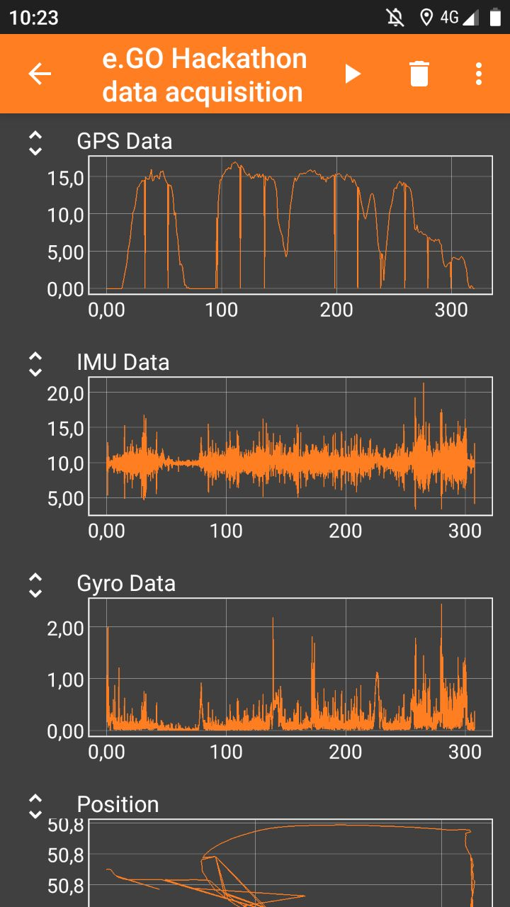
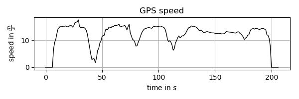
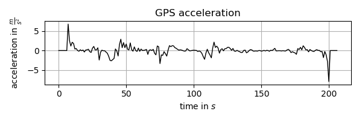
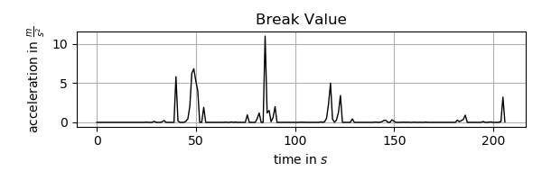
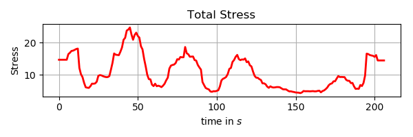
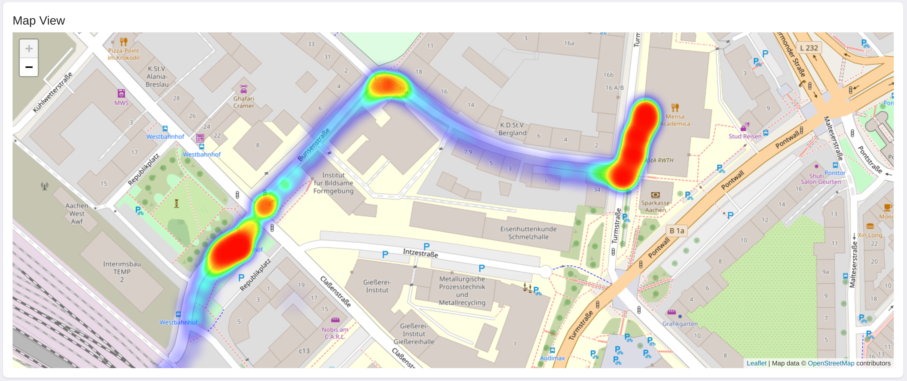
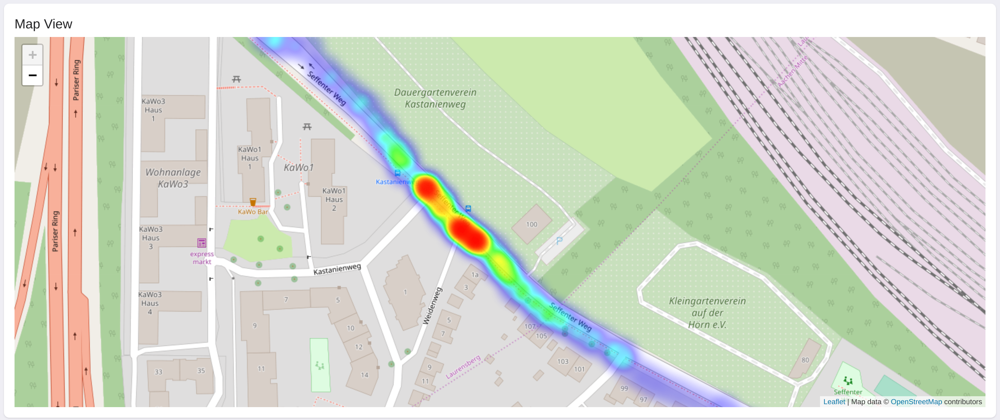
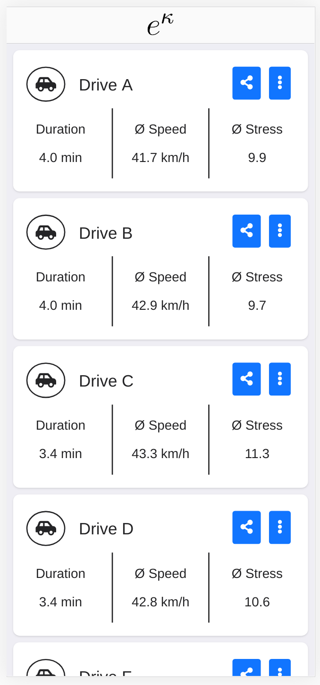
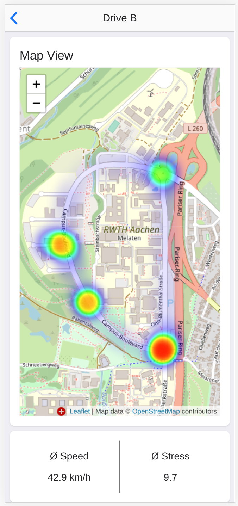
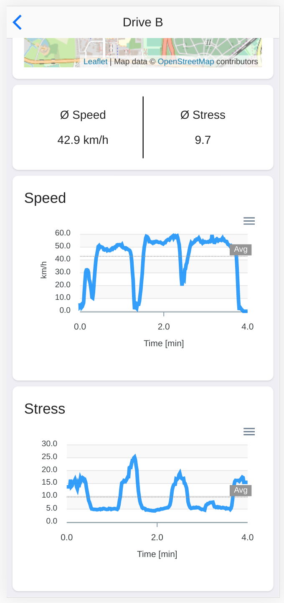

e.GO-digital-Hackathon

# Stressfrei - Team eHochKappa

### Motivation
Jeder kennt es: Auf der Autobahn wird von hinten gedrängelt; in der Stadt meint jeder Vorfahrt zu haben. Das nervt!

Wie wäre es, wenn es eine App gäbe, die den aktuelle Fahrstil des Fahrers ermittelt und die auf einer Heatmap gespeichert wird. So können andere Nutzer Ihre Route um diese Hotspots herum planen und so eine entspannte Reise genießen.

### Sensorik
Aus dem e.GO Fahrzeug werden folgende Messgrößen verwendet:

| Messgröße 					| 	Verwendung 	|
| -------- | ------- |
| 	puls 						| 	Der Puls des Fahrers ist ein direkter Indikator für den Stress des Fahrers. 	|
| 	speed 						|	Die Geschwindigkeit und die Beschleunigung wird ebenfalls genutzt, um den Stress des Fahrers zu bestimmen. Diese Größe kann auch benutzt werden, wenn kein Puls gemessen werden kann. |
| 	location 					| 	Die Position des Fahrzeuges wird benötigt, um die Karte zu generieren. 	|
| 	power_consumption 			| 	Diese Größe kann mit berücksichtigt werden, wenn man die durch das Gaspedal geforderte Beschleunigung bestimmen möchte. 
| 	drive_mode 					| 	Ob der Fahrer sich im Sport oder im ECO Modus befindet kann ebenfalls zur Bestimmung des Stresses des Fahrers genutzt werden. 
| 	flash 						| 	Ob der Fahrer die Lichthupe oft betätigt
| 	distance_to_object_ 		|	Sollte der Fahrer auf andere Fahrzeuge Auffahren (konkret drängeln) oder andere Fahrzeuge knapp überholen (Schneiden), kann man dieses Verhalten aus den Abständen nach hinten und nach vorne ableiten. (In Kombination mit harten Lenkbewegungen)
| 	tire_pressure_back_ 		| 	Wenn der Fahrer eine Kurve zu schnell nehmen sollte, kann man durch die Differenz des Reifendrucks zwischen der rechten und linken Seite eine Größe finden, welche die Schäglage des Fahrzeuges beschreibt.

### Stress
Die Größe, nach der wir suchen, ist der Stress, welcher ein Fahrer verursacht bzw selber verspürt. Wenn Dicht aufgefahren wird, der Puls hoch ist oder intensiv gebremst wird, sollte der Stress-Wert hoch sein.

### Simulation
Da wir nicht alle Daten simulieren konnten haben wir uns dazu entschlossen mit einem Vergleichbaren Fahrzeug und einem Smartphone die GPS Datenpunkte selber zu generieren. Dazu haben wir die Software phyphox der RWTH sowie einen VW Up genutzt.

(Dieser Screenshot passt nicht zu den Unten gezeigten Daten.)

(Die kleinen Lücken in der GPS-GEschwindigkeit sind Stellen, an denen das kein GPS-Signal aufgezeichnet wurde. Diese Stellen werden später einfach hinaus geschnitten)

Diese Daten werden dann mit dem Python-Script generrateSfromphyphox.py ausgewerted. Dabei wir aus den GPS-Daten die Beschleunigung des Fahrzeuges berechnet. Wir haben noch eine Größe "BreakValue" hinzugefügt, welche eine verzögerte Version der Beschleunigung ist (Nur Werte die zum Bremsen passen), welche (mehr oder weniger) den zusätzlichen Stress beschreibt, welchen der Fahrer erfährt, wenn er nicht mehr schnell fahren kann.

Wir haben für die Simulation folgende Funktion benutzt, um den Stress (S) zu berechnen:

$$S = v/50 + (v-50)^8/200 * \Theta(v-50) + 10*|gps_a| + b*3 + other$$

wobei $$other$$ den Lenkrad Puls und die Weiteren Parameter simuliert. Diese sind aber vernachlässigbar klein. 

Und die daraus resultierende Stress-Kurve:

### Heatmap

Stadtfahrt

Streddsituation an einer Bushaltestelle

### Signalweg
Für ein fertiges Produkt ist es sinnvoll diese Daten auf dem Boardcomputer im e.GO zu verarbeiten und nach der Fahrt (oder in Paketen) die Ergebnisse auf einen Server zu schicken. Von da aus kann der User sich dann die aufgezeichneten Fahrten in der WebApp ansehen.

Die Positionsdaten und Stress-Values werden anonym (gegebenen falls auch können die Positionen auch etwas randomisiert werden. Bei genügend Nutzern sollte sich das dann ausgleichen.) in eine globale Heat-Map übernommen. Diese kann dann für die Routenplanung benutzt werden.

### Web Application
Diese Application hängt von folgenden Projekten ab:
- [Onsen UI](https://onsen.io/)
- [Socket.io](https://socket.io/)
- [Leaflet](https://leafletjs.com/)
- [Fontawesome](https://fontawesome.com/) 
- [Apexcharts](https://apexcharts.com/)
- [Node.js](https://nodejs.org/en/) (Version 10.x)

### Messdaten
Die Messdaten werden mit Python analysiert und in JSON-Files gespeichert. Diese JSON-Files werden in den nodejs/public Ordner kopiert. Von dort aus können die Clients darauf zugreifen. Das Verarbeiten der Daten (Berechnung der Stress-Kurve) soll der Boadcomputer des e.GOs für das finale Produkt selber machen.

### Forntend
Die Files für diesen Teil befinden sich in nodejs und nodejs/public.
Die Struktur des Forntends orientiert sich an der Struktur von Onsen UI. index.html definiert die beiden Onsen-Seiten der Web-App. Für die dynamische Erzeugung von Elementen wurden Funktionen in kappa_lib.js definiert.

- page1: Auf der ersten Seite werden als Elemente der Onsen-Navigator <ons-navigator> und die MiniTripCard der Funktion setMiniTripCard verwendet.
- page2: Auf der zweiten Seite werden die selbst geschriebenen Elemente MapCard, Chart und SpeedStressCard verwendet.

Bei einer Verbindung mit dem Server wird zuerst page1 aufgerufen. Über den Socket werden die Informationen über die erhältlichen Fahrten übermittelt. Mit dem Click auf eine Card wird die Detailansicht in page2 aufgerufen. Dazu wird zuerst über die Funktion loadPage() der JSON-File mit allen Messdaten in den Browser geladen. Danach werden die DOM-Elemente einzeln erzeugt und mit den geladenen Daten versorgt.

  
  
  

### Backend
Zu Beginn der Ausführung des Node.js-Servers werden Allgemeindaten der Fahrten aus den JSON-Files in den Arbeitsspeicher geladen und von dort aus, über den Socket, an die Clients weiter verteilt. Die großen Datenmengen holen sich die Clients über jQuery gleich aus den JSON-Dateien.
Node.js wird hier über index.js ausgeführt.

Anmerkung: Die Socket Infrastruktur ist besonders angenehm für eine Realtime-Erweiterung der Web-App.

